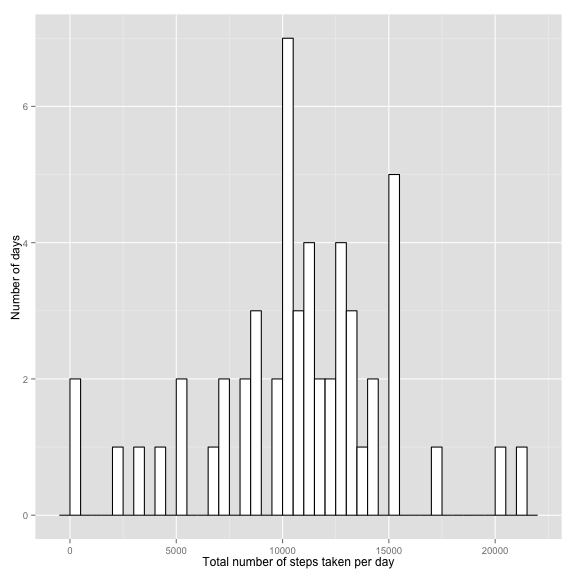
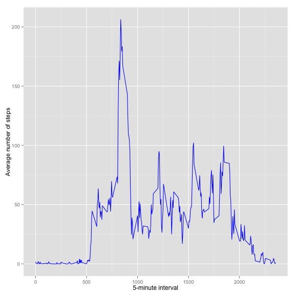
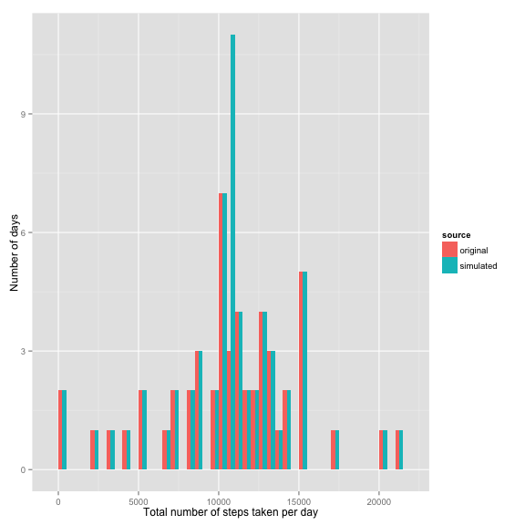
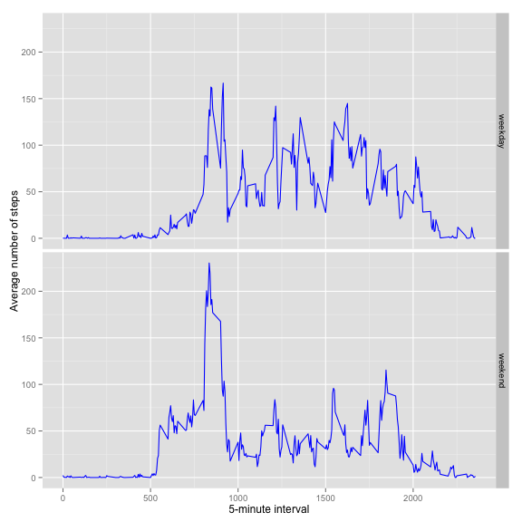

## Introduction

It is now possible to collect a large amount of data about personal
movement using activity monitoring devices such as a
[Fitbit](http://www.fitbit.com), [Nike
Fuelband](http://www.nike.com/us/en_us/c/nikeplus-fuelband), or
[Jawbone Up](https://jawbone.com/up). These type of devices are part of
the "quantified self" movement -- a group of enthusiasts who take
measurements about themselves regularly to improve their health, to
find patterns in their behavior, or because they are tech geeks. But
these data remain under-utilized both because the raw data are hard to
obtain and there is a lack of statistical methods and software for
processing and interpreting the data.

This assignment makes use of data from a personal activity monitoring
device. This device collects data at 5 minute intervals through out the
day. The data consists of two months of data from an anonymous
individual collected during the months of October and November, 2012
and include the number of steps taken in 5 minute intervals each day.


## Loading and preprocessing the data

In this part, we first will try to load the data set from `activity.zip`. 


```r
# read activity data from 
data <- read.csv(unz("activity.zip", "activity.csv"), sep=",")

# covert 'date' column into date format
data$date <- as.Date(data$date, "%Y-%m-%d")

# display a summary of the loaded data
summary(data)
```

```
##      steps             date               interval     
##  Min.   :  0.00   Min.   :2012-10-01   Min.   :   0.0  
##  1st Qu.:  0.00   1st Qu.:2012-10-16   1st Qu.: 588.8  
##  Median :  0.00   Median :2012-10-31   Median :1177.5  
##  Mean   : 37.38   Mean   :2012-10-31   Mean   :1177.5  
##  3rd Qu.: 12.00   3rd Qu.:2012-11-15   3rd Qu.:1766.2  
##  Max.   :806.00   Max.   :2012-11-30   Max.   :2355.0  
##  NA's   :2304
```


## What is mean total number of steps taken per day?

In this part, we will first try to calculate and plot a histogram of the total number of steps taken per day. The plotting package used is [ggplot2][1].


```r
# calculate the sum of steps taken per day
total_steps_per_day <- aggregate(steps ~ date, data = data, sum)

# plot a histogram on the sum of steps taken per day
library(ggplot2)
ggplot(total_steps_per_day, aes(x=steps)) + 
  geom_histogram(binwidth= 500, colour="black", fill="white") + 
  labs(x = "Total number of steps taken per day", y = "Number of days")
```

 

Secondly, we will calculate and report the **mean** and **median** total number of steps taken per day. 


```r
# mean on total number of steps taken per day
mean(total_steps_per_day$steps)
```

```
## [1] 10766.19
```

```r
# median on total number of steps taken per day
median(total_steps_per_day$steps)
```

```
## [1] 10765
```

## What is the average daily activity pattern?

In this part, we will make a time series plot of the 5-minute interval (x-axis) and the average number of steps taken, averaged across all days (y-axis). 


```r
# calculate the mean of each 5-minute interval
average_steps_per_interval <- aggregate(steps ~ interval, data = data, mean)

#TODO: can convert 5-mins interval to the time of the day, this will produce a more readable plot

# plot a time series plot on the result
ggplot(average_steps_per_interval, aes(x=interval, y = steps)) + 
  geom_line(colour="blue") + 
  labs(x = "5-minute interval", y = "Average number of steps")
```

 

Next, we will try to find out which 5-minute on average across all the days, contains the maximum number of steps.


```r
# sort by average number of steps
sorted_average_steps <- average_steps_per_interval[with(average_steps_per_interval, order(-steps)),]

# print out the first element
sorted_average_steps[1,]$interval
```

```
## [1] 835
```

## Imputing missing values

In this part, we first calculate and report the total number of missing values in the dataset (i.e. the total number of rows with NA s).


```r
# count the number of row that have NA
table(complete.cases(data))
```

```
## 
## FALSE  TRUE 
##  2304 15264
```

The **FALSE** column in the output indicates the number of rows that contain NA. 

Next, to fill the missing values in the original dataset, we use the mean for that 5-minute interval across all days. Then, put resulst into a new dataset for further analysis. 


```r
# make a copy of the original dataset
simulated_data <- data.frame(data)

# replace NA values in 'steps' column with the average of that 5-minute interval
simulated_data$steps[is.na(simulated_data$steps)] <- with(data, ave(steps, interval, FUN = function(x) mean(x, na.rm=TRUE)))[is.na(data$steps)]

# display the number of rows have NA
table(complete.cases(simulated_data))
```

```
## 
##  TRUE 
## 17568
```

Now, let's make a histogram of the total number of steps taken each day and calculate and report the **mean** and **median** total number of steps taken per day.


```r
# calculate the sum of steps taken per day
simulated_total_steps_per_day <- aggregate(steps ~ date, data = simulated_data, sum)

# to combine two data frames into one. first, make a new colum in each
simulated_total_steps_per_day$source <- 'simulated'
total_steps_per_day$source <- 'original'

# combine two data frames into a new data frame
compare_total_steps_per_day <- rbind(total_steps_per_day, simulated_total_steps_per_day)

# plot a histogram on the sum of steps taken per day
ggplot(compare_total_steps_per_day, aes(x=steps, fill = source)) + 
  geom_histogram(binwidth= 500, position="dodge") + 
  labs(x = "Total number of steps taken per day", y = "Number of days")
```

 

Finally, let's compare the **mean** and **median** total number of steps taken per day.


```r
# the original mean on total number of steps taken per day
mean(total_steps_per_day$steps)
```

```
## [1] 10766.19
```

```r
# the simulated mean on total number of steps taken per day
mean(simulated_total_steps_per_day$steps)
```

```
## [1] 10766.19
```

```r
# the original median on total number of steps taken per day
median(total_steps_per_day$steps)
```

```
## [1] 10765
```

```r
# the simulated median on total number of steps taken per day
median(simulated_total_steps_per_day$steps)
```

```
## [1] 10766.19
```

One can see from the results that the mean of the dataset did not change, the median however has shifted. 

## Are there differences in activity patterns between weekdays and weekends?

In this part of the assessment, we will try to find out the whether there are any differences in activity patterns between weekdays and weekends using the simulated dataset.

First, we need to prepare the dataset so that we know which date is **weekday** or **weekend**.


```r
# define a function that can infer weekday or weekend
infer.weekday <- function(x) {
  result = "weekday"
  
  if (!weekdays(x) %in% c('Saturday', 'Sunday')) {
    result = "weekend"
  }
  
  result
}

# add one extra colum to simulated dataset to indicate the day of the week
simulated_data$day <- sapply(simulated_data$date, infer.weekday)

# calculate the mean of each 5-minute interval
simulated_average_steps_per_interval <- aggregate(steps ~ interval + day, data = simulated_data, mean)

# create faceted plot which show the activity differences between weekday and weekends
ggplot(simulated_average_steps_per_interval, aes(x=interval, y = steps)) + 
  geom_line(colour="blue") +
  facet_grid(day ~ .) +
  labs(x = "5-minute interval", y = "Average number of steps")
```

 

[1]: http://ggplot2.org/ "R ggplot2 package"
